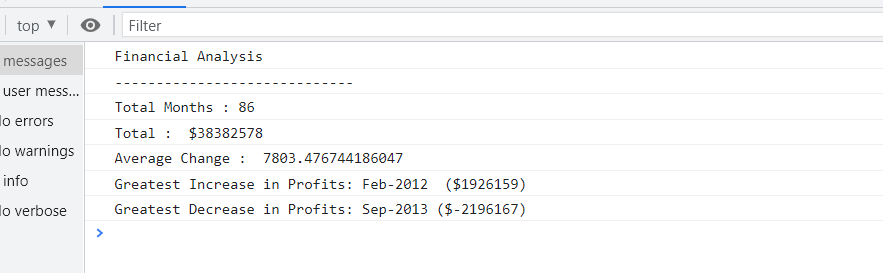

# Console-Finances

<picture>

</picture>

## Description
This is the JavaScript code to analyzes total number of months, total amount of profit/losses over the entire period, Average of profit/losses ( month to month ), Greatest increase in profits, Greatest decrease in losses.

## Installation

N/A

## Usage

To use this web page, navigate to the above site using chrome browser.

https://deepasu1.github.io/Console-Finances/ 

https://github.com/DeepaSU1/Console-Finances

https://github.com/DeepaSU1/Console-Finances/blob/main/index.js

### User Story

Your task is to write JavaScript code that analyzes the records to calculate each of the following:

* The total number of months included in the dataset.

* The net total amount of Profit/Losses over the entire period.

* The average of the **changes** in Profit/Losses over the entire period.
  * You will need to track what the total change in profits are from month to month and then find the average.
  * (`Total/Number of months`)

* The greatest increase in profits (date and amount) over the entire period.

* The greatest decrease in losses (date and amount) over the entire period.

### Acceptance Criteria

When you open your code in the browser your resulting analysis should look similar to the following:

  ```text
  Financial Analysis
  ----------------------------
  Total Months: 25
  Total: $2561231
  Average  Change: $-2315.12
  Greatest Increase in Profits: Feb-2012 ($1926159)
  Greatest Decrease in Profits: Sep-2013 ($-2196167)
  ```

Final code should print the analysis to the console.